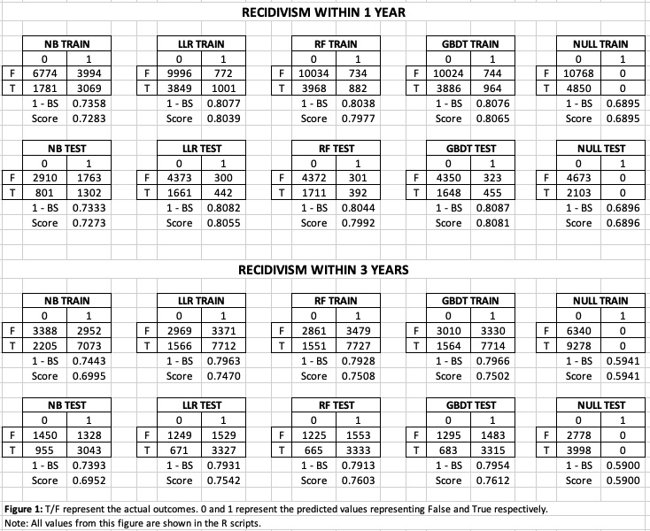
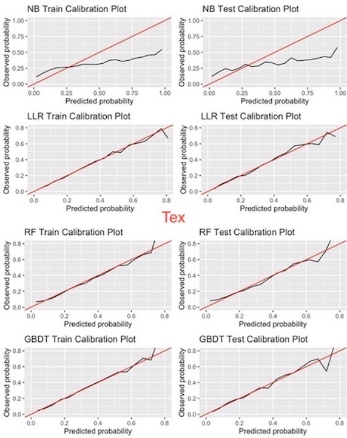
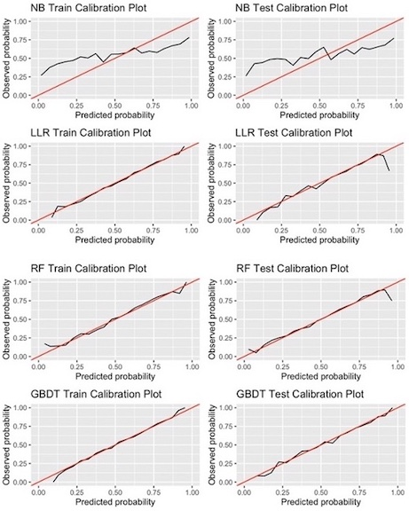
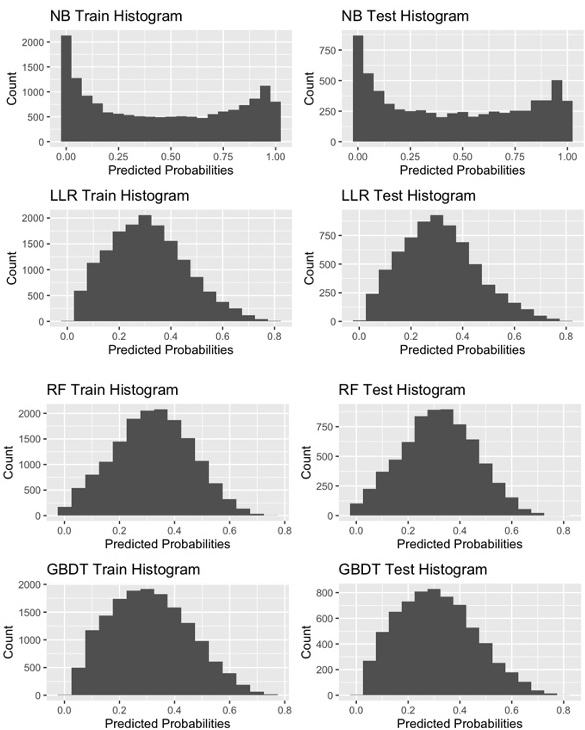
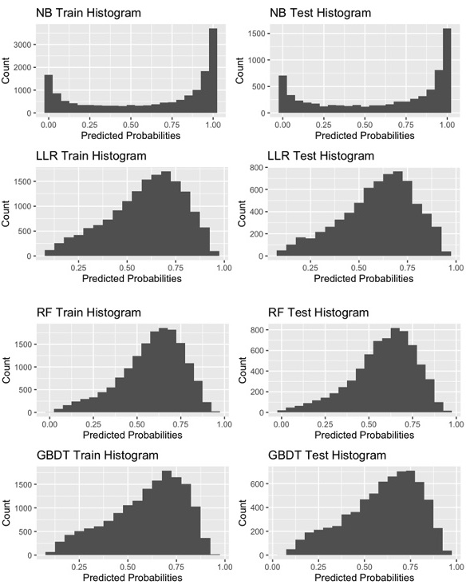

# Table of Contents

[1. Abstract](#abstract)

[2. Introduction](#introduction)

[3. Methods](#methods)

 - [Data](#data)
 
 - [Scope](#scope)
 
 - [Scoring Rules](#scoring-rules)
 
 - [Models](#models)
 
[4. Results](#results)

[5. Conclusion](#conclusion)

\vspace{12pt}

\vspace{12pt}
  
# Abstract 

  This paper investigates the potential of machine learning models to enhance parole board decision-making by providing probabilistic estimates of recidivism likelihood for individual prisoners. Utilizing data mining techniques such as Naive-Bayes, Lasso-Logit Regression, Random Forest, and Gradient-Boosted Decision Trees, this study aims to establish a fundamental understanding of how to evaluate and select models for recidivism prediction based on multiple criteria. Although Lasso-Logit Regression and Gradient-Boosted Decision Tree models demonstrated superior performance, the primary objective of this paper is not to advocate for their exclusive use. Instead, the study compares the evaluation metrics of the developed models, including the Brier Score, fairness, informativeness, and calibration, to offer insights into selecting the most suitable machine learning models for recidivism prediction and illustrating their utility for parole board members. The research also explores the inherent trade-offs between public safety and racial equality identified by the models when determining the optimal time frame for recidivism prediction, suggesting that parole boards should thoughtfully consider the implications of various time frames on their decision-making process.

  
\newpage


# Introduction 

  Recidivism is a pressing issue in the United States criminal justice system. It pertains to the relapse of a person into criminal activities, often after being sanctioned for a previous offense. According to the National Institute of Justice (NIJ), 68% of released prisoners returned to criminal behavior within 3 years, 79% within 6 years, and 83% within 9 years. This trend raises two critical questions for parole considerations: First, how can the government strike a balance between ensuring public safety and providing opportunities for rehabilitation, while also eliminating racial biases, in prisoner releases? Second, what steps can be taken to assist ex-offenders in preventing future criminal activity and successfully reintegrating into society?

  This paper focuses on addressing the first question, not by providing direct solutions, but by leveraging machine learning techniques to offer valuable insights and equip parole boards or policymakers with data-driven tools to enhance their decision-making processes. Specifically, this study will examine and compare the efficacy of various machine learning approaches in predicting the likelihood of recidivism, ultimately aiming to contribute to a more informed and equitable parole system.

# Methods

## Data

  My analysis uses data from a sample of roughly 22,000 male individuals in Georgia who were released on discretionary parole from state prisons and placed under the supervision of the Georgia Department of Community Supervision (GDCS) for post-incarceration monitoring between January 1, 2013, and December 31, 2015. The dataset combines individual-level information from two sources: the GDCS and the Georgia Crime Information Center (GCIC). The GDCS data includes post-sentence information such as parole case information, supervision activities, and recidivism measures along with demographic information. The GCIC data provides prior criminal history measures, including the individual's previous arrests and convictions, commonly referred to as the 'rap sheet.' All parameters that would not have been available at the time of the parole hearings were dropped. 
  
  The primary focus of my analysis is to examine recidivism, defined as any criminal acts resulting in an individual's rearrest. In this dataset, episodes of arrest with multiple charges are documented based on the most serious charge, except for criminal history charges relating to domestic violence and gun offenses, which are counted for all charges.
  
  In conducting this analysis, I employed a 70/30 split approach. The training set, which accounts for 70% of the data, was used for model training, cross-validation, and hyper-parameter tuning, while the remaining 30% was reserved for final testing of all models. Additionally, imputing NaN values and making variable modifications were essential steps in the analysis. Notably, the following changes were made:
  
  * To deal with NaN values in drug tests, I converted them to categorical variables with values 0, 1, and 2, representing tested negative, tested positive, and not tested, respectively.
  
  * Employment data were simplified to a binary variable with a value of 0 if an individual worked less than 50% of the time and 1 if they worked more than 50% of the time.
  
  * For numerical data that had a maximum value of "or more," such as "10 or more," I simply changed it to "10," and these variables were retained as numerical predictors.
  
  * NaN values in the categorical variable Prison_Offense were imputed with "Unknown."
  
  * NaN values in the variables Supervision_Risk_Score_First and Supervision_Level_First were imputed based on each other. For example, I imputed NaN values for risk scores for individuals with "specialized" supervision as 9, and NaN values for supervision level for those with risk scores of 9 or 10 as "specialized." This final step of data cleaning resulted in approximately 275 NaN values, which represented a small portion of the data and were subsequently dropped.
  
## Scope 

  My analysis focuses on the recidivism rates during the initial year following release and the recidivism rates within the first 3 years of release. The pattern shows that the likelihood of re-offending decreases with each passing year of non-recidivism. Based on the available data, approximately 31% of parolees re-offended within the first year of release. Of those who avoided recidivism during the first year, only 26% did so in the second year. Among those who remained non-recidivists during the first two years, only 20% went on to re-offend in the third year. Furthermore, the NIJ states that of all released prisoners re-arrested within 9 years, 82% of them were arrested within the first 3 years.  While these associations are not necessarily causal, understanding the probability of recidivism in the first year and the first 3 years provides a foundation to determine whether to grant parole and to identify strategies to prevent recidivism. 
  
  It is important to note that the models presented in this paper are specific to prisoners in Georgia. While these models can be utilized as a foundation for other states, it is important to recognize that behavioral differences and the level of government support for released prisoners may vary across states and are not reflected in the data. Additionally, it should be noted that macroeconomic conditions, although potentially captured in the employment variable, were not explicitly considered in these models. 

## Scoring Rules

  The scoring rules for model performance used in this paper are adapted from the [National Institute of Justice: Recidivism Forecasting Challenge](https://nij.ojp.gov/funding/recidivism-forecasting-challenge#j1k4m){style="color: blue; text-decoration: underline;"}. 

  To ensure fairness in the determination of parole decisions, the parole board needs to consider two key factors. Firstly, they must balance public safety with the opportunity for prisoners to rehabilitate and re-enter society. To aid in this, I will compare the results of various machine learning models that can predict the probability of an individual recidivating. The accuracy of these models will be measured using the Brier Score.

$$ BS = \frac{1}{N} \sum\limits_{i=1}^N (p_i - A_i)^2 $$

N is the number of observations or the count of individuals in the dataset. $p_i$ is the predicted probability of recidivism for individual $i$ from my model. $A_i$ is the actual outcome (0,1) for individual $i$. 

  The second factor regarding fairness is that of racial equality. It is important that parole decisions are not influenced by an individual's race. Therefore, the machine learning models used to predict recidivism should not display racial bias. This can be measured by examining the absolute difference in false positive rates between white and black parolees, as determined by the machine learning models. Therefore, it makes sense to add a fairness penalty based on the difference in false positive rates. 
  
$$FP = 1 - \left\vert FPR_{b} - FPR_{w} \right\vert$$

  Since the Brier Score is a measure of error on predictions bound between 0 and 1, it is reasonable to consider one minus the Brier Score a metric of correctness. Consequently, the overall score that measures model accuracy while accounting for bias can be delineated as:
  
$$Score = (1 - BS) \cdot FP$$

## Models

  To determine the likelihood of recidivism for parole boards, I evaluated the performance of four types of models: Naive-Bayes (NB), Lasso-logit regression (LLR), Random Forest (RF), and Gradient-boosted Decision Trees (GBDT). The NB models were included as a simple and computationally efficient baseline model. The LLR models, on the other hand, required tuning of the lambda.min.ratio, which is the L1-regularization penalty in the gamlr package. To select the optimal values of lambda.min.ratio, six-fold cross-validation was used. The final values of lambda.min.ratio were selected by choosing the regularization coefficients that were one standard error above the optimal value. The selected values for recidivism within 1 year and 3 years were 0.0085 and 0.0082, respectively. The RF model did not require tuning and used 1000 trees for training. 
  
  For the GBDT models, hyper-parameters were tuned using Bayesian Optimization. Due to the computationally expensive nature of the computations, a two-stage tuning process was implemented. First, num_leaves, learning_rate, max_depth, and feature_fraction were tuned, followed by the tuning of bagging_fraction, reg_alpha, and reg_lambda to further prevent over-fitting. For predicting recidivism within 1 year, the second set of hyper-parameters did not reduce the cross-validated Brier Score of the train set, and thus was not used. However, the second set of hyper-parameters was employed for predicting recidivism within 3 years. Please refer to the following table for a summary of the hyper-parameter values used in the training of the final GBDT models:
  
\begin{table}[ht]
\centering
\begin{tabular}{rlll}
  \hline
 & Parameters & Recidivism\_1Year & Recidivism\_3Years \\ 
  \hline
1 & num\_leaves & 38 & 5 \\ 
  2 & learning\_rate & 0.1474 & 0.1554 \\ 
  3 & max\_depth & 2 & 8 \\ 
  4 & feature\_fraction & 0.8933 & 0.9711 \\ 
  5 & bagging\_fraction & Not Used & 0.799 \\ 
  6 & reg\_alpha & Not Used & 0.0677 \\ 
  7 & reg\_lambda & Not Used & 0.1962 \\ 
   \hline
   Table 1: LightGBM Hyper-Parameter Values
\end{tabular}
\end{table}  
  
```{r, echo=FALSE}
# library(xtable)
# 
# parameter_table <- data.frame(
#   Parameters = c('num_leaves', 'learning_rate', 'max_depth', 'feature_fraction', 'bagging_fraction', 'reg_alpha', 'reg_lambda'),
#   Recidivism_1Year = c(38, 0.1474, 2, 0.8933, 'Not Used', 'Not Used', 'Not Used'),
#   Recidivism_3Years = c('5', 0.1554, '8', 0.9711, 0.7990, 0.0677, 0.1962)
# )
# 
# parameter_table <- xtable(parameter_table, include.rownames = FALSE)
# print(parameter_table)
# print('Table 1')
```
  
  
  To provide a comprehensive view of the predictions for the entire dataset, predictions were made on both the train and test sets for all models. For the train set, predictions were made for all instances using cross-validation with six folds, where the model was trained on five folds and predictions were made on the sixth fold until all observations had predictions. The final models were then trained on all the training data to make predictions on the test set. It is worth noting that the hyper-parameters for the GBDT models were tuned in Python using the HyperOpt and LightGBM packages. The tuned hyper-parameters were then used for model training in R using the R-version of the LightGBM package.
  

# Results

  Figure 1 below displays the predicted probabilities for Recidivism within 1 year and Recidivism within 3 years. The figure also contains confusion matrices, along with the initial accuracy measure (one minus the Brier Score), and the final score that penalizes the model's accuracy based on differences in false positive rates between white and black males. Null models were included for reference, and they simply predict the mean outcome. In the confusion matrices, 'F' and 'T' represent the actual occurrence of recidivism, while '0' and '1' represent 'False' and 'True,' respectively, for the predicted outcome using a threshold of 0.5. While the models presented in this paper do not aim to maximize the number of correctly predicted outcomes, the confusion matrices are useful in showing the behavior of various models with respect to sensitivity and specificity. Although the RF model's random seed was set, small variations still occurred, likely due to the randomness of the bootstrap used in RF. However, these differences were insignificant and do not change the conclusions drawn from the models.
  
\newpage
  


  In all scenarios, LLR, RF, and GBDT models exhibited superior performance compared to NB models and slightly outperformed Null Models, as depicted in Figure 1. The NB models suffered a severe penalty for generating excessive bad predictions on the distribution's tails (Figure 4 in the appendix). For predicting recidivism within one year, LLR, RF, and GBDT models achieved a score of approximately 0.8, with minimal impact from the fairness penalty. LLR and GBDT models exhibited comparable distribution of predicted probabilities (Figure 4), and they marginally outperformed the RF model by making more predictions on the tails of the distribution. The RF model, on the other hand, generated more predictions near the mean, as evidenced by the confusion matrices (Figure 1) and histograms (Figure 4 in the appendix).

  For recidivism within three years, the Brier Score was only slightly worse in the models, with one minus the Brier Score hovering just below 0.8. However, the fairness penalty had a more significant effect on these models, bringing the final scores to around 0.75. This result is likely because recidivism rates are much higher over an extended period, resulting in more false positives and a greater gap in false positive rates between black and white males. Specifically, the difference in false positive rates between white and black males in these cases was approximately 5%.
  
  Figures 2 and 3 in the appendix display calibration plots, which compare the predicted probabilities of the positive class to the observed frequencies in the data. These plots are critical for decision-making models, as they provide valuable information on the reliability of model predictions. A well-calibrated model inspires greater confidence that its predicted probabilities are close to the true probabilities. However, assessing calibration plots alone is insufficient. The Null Model, for instance, is perfectly calibrated but uninformative. An informative and reliable model should predict more probabilities closer to 0 or 1 while maintaining good calibration. Figures 2 and 3 illustrate that the NB models are poorly calibrated, while the other models are well-calibrated except at the distributions' tail ends. This is likely due to insufficient observations at the extremes. Figures 4 and 5 show that the LLR and GBDT models are slightly more informative than the RF model, as they make more predictions with probability estimates closer to 0 or 1.
  
  
# Conclusion 
  
  The study findings highlight two main insights. Firstly, machine learning models can be a useful tool for parole board members to assess the risk of an individual recidivating by providing probabilistic estimates. These models can help to augment the decision-making process and provide objective, data-driven insights that may not be immediately apparent through human judgment alone. The second takeaway is that selecting the appropriate model for parole board hearings requires careful consideration of various factors. Rather than relying solely on one factor, a variety of considerations such as the specific needs of the jurisdiction, available data, fairness and equity concerns, and potential biases in the models should be taken into account when selecting an appropriate model.
  
  The role of a parole board member is to carefully balance public safety concerns with the potential for rehabilitation and successful reintegration into society for individuals who have been convicted of a crime. This involves reviewing and analyzing vast amounts of information, including both subjective and objective factors. However, parole board members face challenges in their decision-making process, such as the absence of immediate feedback to evaluate the effectiveness of their decisions. Additionally, board members may be susceptible to bias, particularly when analyzing objective data, which can lead to overlooking important variables or giving more weight to less important ones. One way to mitigate these challenges is to incorporate machine learning models into the parole board's risk analysis process. These models can provide objective risk assessments based on factors such as criminal history and demographic information, which can serve as a valuable starting point. The use of well-calibrated machine learning models, such as the LLR and GBDT models presented in this paper, can help mitigate potential biases and provide informative and objective risk assessments to support the parole board's decision-making process.
  
  Selecting the appropriate machine learning model or models for use in parole board hearings is a critical task. It is important to evaluate the models based on multiple criteria, rather than relying on a single metric. One such metric used to evaluate the models was the Brier Score, which suggested that the machine learning models offered only a small improvement over the Null models. However, these models were significantly more informative than the Null models, as the Null models simply assert that everyone has the same probability of recidivism. On the other hand, the NB models provided many high and low probability estimates, which is extremely informative, but this resulted in poor calibration of the NB models. After taking into account all these considerations, the results showed that the LLR and GBDT models were the most appropriate as they provided well-calibrated and reliable probability estimates. While these models were less informative than the NB models, they were significantly more informative than the Null models.
  
  Selecting the appropriate time frame for machine learning models is another important decision when considering their use in parole board hearings. The models presented in this study show an inherent trade-off between public safety and recial equality. When predicting recidivism within one year, the models assign lower probabilities of recidivism, which can result in releasing more prisoners who may re-offend, but also result in lower false positive rates. As the time frame increases, the models assign higher probabilities of recidivism, which can result in fewer prisoners being released, but also lead to more false positive instances and a wider disparity in false positive rates between white and black males. Parole boards must consider whether to use a one-year recidivism model to be more fair to prisoners or a three-year model to potentially improve public safety. Alternatively, they could even consider providing results for each year for the first five years and note that racial bias may increase as the time frame increases. Or maybe the state needs to focus on the first year due to budget cuts or prisons running out of space. This study leaves the questions for the appropriate civil authorities to decide.
  
  Finally, it is worth noting that further research and more extensive data can improve the accuracy and reliability of machine learning models for use in parole board decision-making. These efforts may also help to reduce any potential racial bias between white and black males. It is important to emphasize that the models presented in this paper should not be viewed as the definitive models for use in government parole board hearings. Furthermore, the study does not claim that the LLR or GBDT models will always be the most suitable for this purpose. Instead, the goal of this paper is to demonstrate the potential of machine learning to support the decision-making process and provide guidance and considerations for model selection. Future research and data collection efforts can help to refine machine learning models for use in parole board hearings, and the findings of this study should be considered as a starting point rather than a definitive solution. By continuing to explore new methods and approaches, we can improve the fairness, accuracy, and reliability of machine learning models in support of the parole board decision-making process.

\newpage
  
# Appendix 
 <br>









  